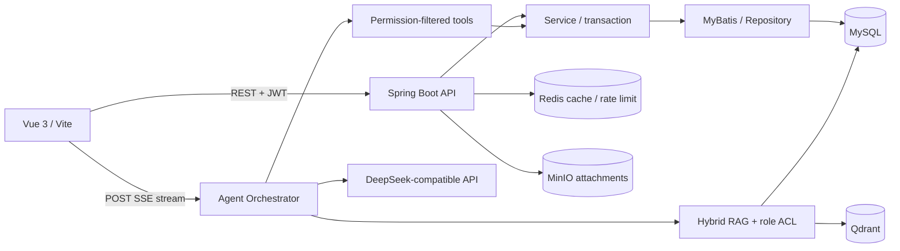

# 安顺户外广告数据管理与智能 Agent 平台

这是一个面向户外广告点位、租赁合同和经营分析的全栈项目。当前主后端为 **Java 17 + Spring Boot 3**，前端为 **Vue 3 + TypeScript**；系统在常规业务管理之上实现了 RBAC、合同审批、并发冲突控制、操作审计、对象存储，以及带 RAG、工具调用和人工确认的业务 Agent。

> 项目定位：可本地完整运行的企业应用原型，用于展示 Java 后端工程能力和 AI 应用后端设计。`dms/server/` 是迁移前保留的 Express 版本，仅作历史对照；当前开发、测试和部署均以 `backend-java/` 为准。

## 核心能力

| 领域 | 已实现能力 |
| --- | --- |
| 业务管理 | 广告点位与租赁合同的分页查询、录入、修改、逻辑删除和统计看板 |
| 权限安全 | Spring Security + JWT；管理员、运营、财务、审核、只读访客五类角色；接口级权限校验 |
| 合同流程 | 草稿、提交、通过、驳回；提交人不能审核自己的合同；审核动作进入审计日志 |
| 数据一致性 | 点位与合同乐观锁；合同审批时通过数据库行锁和租期重叠校验避免重复出租 |
| 文件与审计 | 上传文件真实签名校验；MinIO 删除 Outbox 失败重试；关键操作记录操作人、结果、来源 IP、耗时和请求 ID |
| Agent | DeepSeek 兼容接口、SSE 流式回答、有界线程池过载保护、断连取消、会话历史、工具调用轨迹与反馈 |
| 受控写操作 | Agent 只能生成新增点位草稿；用户确认后再次鉴权，并以摘要校验、有效期和幂等状态保护执行 |
| RAG | MySQL 保存文档和分块并执行角色过滤；关键词与 Qdrant 向量结果混合检索；异常时回退关键词检索 |
| 工程化 | Flyway、OpenAPI、Redis 缓存与限流、结构化日志、请求 ID、Docker Compose、自动化测试和 CI |

## 技术栈

- 后端：Java 17、Spring Boot 3.5.16、Spring Security、Spring Validation、MyBatis、JdbcTemplate
- 数据：MySQL 8、Flyway、Redis
- 文件与检索：MinIO、PDFBox、Qdrant
- AI：DeepSeek OpenAI-compatible Chat Completions、Function Calling、SSE、可替换 Embedding 接口
- 前端：Vue 3、TypeScript、Vite、Element Plus、ECharts、Pinia
- 质量保障：JUnit 5、MockMvc、Mockito、Testcontainers、Maven Wrapper、GitHub Actions

## 架构



受控写操作不会由模型直接修改数据库：

```text
模型调用 prepare 工具
  → 后端生成待确认草稿并保存 SHA-256 摘要
  → 用户在页面核对并确认
  → 后端再次检查用户、权限、有效期和完整性
  → 复用业务 Service 执行
  → 写入业务审计和 Agent 轨迹
```

## 项目结构

```text
.
├── backend-java/                  # 当前 Spring Boot 后端、Flyway、测试、Docker Compose
│   └── src/main/java/com/anshun/dms/
│       ├── controller/            # HTTP、鉴权入口
│       ├── service/               # 事务与业务规则
│       ├── mapper/ repository/    # 数据访问
│       ├── agent/ ai/             # 工具调用、RAG、模型适配
│       ├── security/ audit/       # JWT、RBAC、操作审计
│       └── storage/               # MinIO 文件存储
├── dms/                           # Vue 3 前端；server/ 为旧 Express 参考实现
├── AI知识库测试资料.txt            # 不含真实业务数据的公开演示资料
└── .github/workflows/ci.yml       # 后端验证与前端构建
```

## 一键启动

### 前置条件

- Docker Desktop，且 Docker daemon 已启动
- 首次构建需要能够访问 Docker Hub 和 Maven/npm 依赖仓库

### 1. 配置可选的 AI 能力

```bash
cd /path/to/dms-anshun/backend-java
cp .env.example .env
```

在本地、不会提交 Git 的 `.env` 中填写自己的密钥；不要把密钥写入源码、Compose 或 README：

```properties
DEEPSEEK_API_KEY=your-own-key
DEEPSEEK_MODEL=deepseek-v4-pro
```

不配置密钥也可以使用全部常规业务功能；只有依赖外部模型的对话和 Agent 评测不可用。

### 2. 启动完整环境

```bash
docker compose up --build -d
docker compose ps
docker compose logs -f app
```

当 `app` 显示 `healthy` 后访问：

- 系统：http://localhost:8082
- Swagger UI：http://localhost:8082/swagger-ui.html
- 健康检查：http://localhost:8082/actuator/health
- MinIO 控制台：http://localhost:9003
- Qdrant Dashboard：http://localhost:6333/dashboard

本地演示管理员为 `admin / admin123`。该账号只用于本地初始化，非本地部署必须修改密码、JWT 密钥以及 MySQL/MinIO 凭据。

停止容器：

```bash
docker compose down
```

`docker compose down -v` 会同时删除 MySQL、MinIO 和 Qdrant 本地数据卷，仅应在确定不保留数据时使用。

## IDEA / 本地开发

先只启动依赖：

```bash
cd /path/to/dms-anshun/backend-java
docker compose up -d mysql redis minio qdrant
cp -n .env.example .env
```

在 `backend-java/.env` 中加入本地依赖端口。Spring Boot 会从该文件加载配置：

```properties
DB_HOST=127.0.0.1
DB_PORT=3307
DB_NAME=anshun_ad_db
DB_USERNAME=root
DB_PASSWORD=change-me-in-production
REDIS_HOST=127.0.0.1
REDIS_PORT=6380
CACHE_TYPE=redis
TOKEN_BLACKLIST_ENABLED=true
MINIO_ENDPOINT=http://127.0.0.1:9002
MINIO_ACCESS_KEY=minioadmin
MINIO_SECRET_KEY=minioadmin-change-me
VECTOR_STORE_ENABLED=true
QDRANT_BASE_URL=http://127.0.0.1:6333
```

启动后端：

```bash
./mvnw spring-boot:run
```

也可以在 IDEA 中将 `backend-java` 作为 Maven 工程导入，选择 JDK 17，运行 `com.anshun.dms.DmsApplication`。后端默认监听 http://localhost:8081。

另开终端启动前端热更新服务：

```bash
cd /path/to/dms-anshun/dms
corepack enable
pnpm install --frozen-lockfile
pnpm dev:web
```

访问 http://localhost:5173。Vite 会把 `/api` 代理到 `http://localhost:8081`。

## 演示数据与隐私

Flyway 负责创建表和基础权限数据。公共仓库不包含任何真实业务台账、承租单位信息或历史导出数据；首次启动后可通过页面录入自定义演示数据。`AI知识库测试资料.txt` 仅描述系统规则，可用于验证知识库检索，不包含真实合同或财务记录。

## 测试与构建

后端验证：

```bash
cd backend-java
./mvnw verify
```

Docker 可用时，Testcontainers 集成测试会用独立 MySQL 验证 Flyway 和真实并发写入；其数据不会写入开发数据库。
`verify` 还会执行 JaCoCo 覆盖率门禁；文件签名、对象存储补偿、Redis 黑名单故障策略和 AI 流过载/取消均有独立回归测试。

前端验证：

```bash
cd dms
pnpm install --frozen-lockfile
pnpm build:web
```

提交到 GitHub 后，`.github/workflows/ci.yml` 会分别执行后端测试与打包、前端依赖锁定安装与生产构建。

## Agent 与 RAG 边界

- 模型不能生成并执行任意 SQL，只能调用后端注册并按当前用户权限过滤的业务工具。
- 默认 `AI_EMBEDDING_PROVIDER=hash` 是可离线运行的中文 n-gram 哈希向量，并不等同于语义 Embedding。
- 若要启用真实语义向量，在本地 `.env` 配置 OpenAI-compatible `/embeddings` 服务，并确保 Embedding 与 Qdrant 维度一致：

```properties
AI_EMBEDDING_PROVIDER=openai
AI_EMBEDDING_BASE_URL=https://your-provider.example/v1
AI_EMBEDDING_API_KEY=your-own-embedding-key
AI_EMBEDDING_MODEL=your-embedding-model
AI_EMBEDDING_DIMENSIONS=1024
QDRANT_VECTOR_DIMENSIONS=1024
```

- 知识文本和角色权限以 MySQL 为可信来源，Qdrant 只保存向量与分块标识；向量服务不可用时自动回退关键词检索。
- 当前受控写工具只覆盖“新增广告点位草稿”，且必须由用户二次确认。删除、角色分配和合同审批不开放给模型。
- 本仓库的 Compose 用于本地开发和演示，不等同于生产集群部署；生产环境应使用独立密钥管理、HTTPS、备份和监控设施。
- 启用 `prod` Profile 时，应用会拒绝仓库自带的 JWT、MySQL、MinIO 演示密钥；若数据库仍是 `admin / admin123`，必须通过 `BOOTSTRAP_ADMIN_PASSWORD` 在首次安全启动时完成一次性换密。

## 接口与排障

- OpenAPI JSON：http://localhost:8081/v3/api-docs（Docker 为 8082）
- 请求携带或响应生成 `X-Request-Id`，可用它关联结构化日志和审计记录。
- 查看后端日志：`docker compose logs -f app`
- 查看所有服务状态：`docker compose ps`
- 若终端提示无法连接 Docker daemon，先启动 Docker Desktop，再重新执行 Compose 命令。
- 若 8081 或 8082 被占用，可设置 `SERVER_PORT` 或 `APP_HOST_PORT` 后重新启动。

更多后端实现细节见 [`backend-java/README.md`](backend-java/README.md)。
