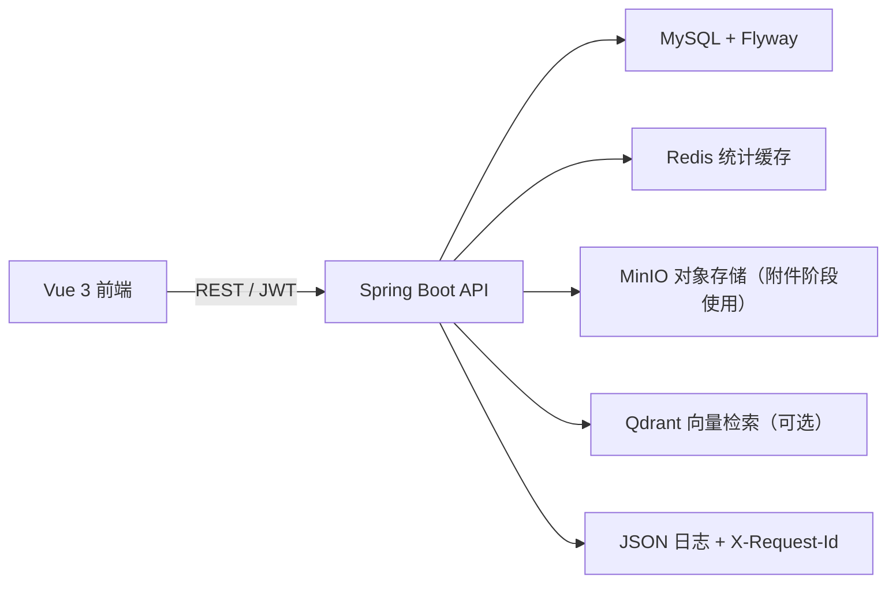
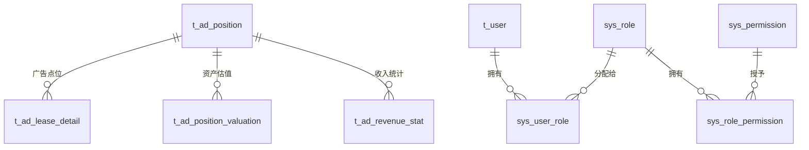

# DMS 安顺广告系统 · Spring Boot 后端

该模块已经替代原 `dms/server/` 中的 Express 后端。Vue 前端与接口路径保持兼容，无需修改页面代码。

## 技术栈

- Java 17+、Spring Boot 3.5.16、Spring Security、JWT、Actuator、Micrometer
- MyBatis（认证、用户角色、点位、合同等模块采用 XML Mapper；统计聚合使用独立 JdbcTemplate Repository）
- MySQL 8（兼容 5.7 的现有数据表）
- 原 Vue 3 + Vite 前端仍位于 `../dms/`

## 配置

无需手工执行 `schema.sql`，Flyway 会在空库中按版本创建并升级表结构。应用使用环境变量读取连接信息，避免把密码写入源码：

```bash
export DB_HOST=127.0.0.1
export DB_PORT=3306
export DB_NAME=anshun_ad_db
export DB_USERNAME=root
export DB_PASSWORD='你的 MySQL 密码'
export JWT_SECRET='至少 32 字节随机密钥的 Base64 编码'
```

开发环境可以不设置 `JWT_SECRET`，但 `prod` Profile 强制要求设置。Flyway 会创建本地演示账号 `admin / admin123`；生产启动会拒绝演示密钥，并要求通过 `BOOTSTRAP_ADMIN_PASSWORD` 对该账号完成一次性换密。

## 开发启动

需要 JDK 17+、Node.js 与 pnpm。项目已包含 Maven Wrapper，因此不需要单独安装 Maven。

```bash
# 终端一：Spring Boot API，默认 http://localhost:8081
cd backend-java
./mvnw spring-boot:run

# 终端二：Vue 开发服务器，默认 http://localhost:5173
cd dms
pnpm install
pnpm dev:web
```

也可以在 `dms/` 运行 `pnpm dev`，它会同时启动 Java 后端与 Vite。Vite 已将 `/api` 代理到 `8081`。

## 构建与运行

```bash
cd dms
pnpm build
pnpm start
```

构建后的 Vue 文件位于 `dms/dist/`，Spring Boot 会自动托管这些静态文件和 SPA 路由；最终访问 `http://localhost:8081`。

## 接口兼容性

认证、点位、租赁合同和统计分析的全部既有 `/api/...` 接口均保留，前端不需要更改请求参数或响应字段。

## RBAC 权限管理（第一阶段已实现）

系统启动时会初始化角色、权限及关联表：`sys_role`、`sys_permission`、`sys_user_role`、`sys_role_permission`。已内置系统管理员、运营专员、财务人员、审核员与只读访客五类角色。

- `ADMIN`：拥有全部权限；原 `admin` 账号会自动迁移为该角色。
- 新注册用户默认获得 `VIEWER` 只读角色。
- 所有点位、合同、统计接口均已按权限码在后端校验；仅隐藏菜单不构成授权。
- 管理员可调用 `GET /api/system/users`、`GET /api/system/roles`、`GET /api/system/permissions`，以及 `PUT /api/system/users/{id}/roles` 分配角色。角色变更会递增用户安全版本，旧 JWT 立即失效。

## 操作审计日志

关键写操作通过 `@OperationLog` 和 Spring AOP 自动记录到 `sys_operation_log`：账号注册/登录/退出、点位和合同的新增/修改/删除、用户角色分配。记录内容包含操作人、模块、动作、业务对象、请求 ID、来源 IP、执行结果和耗时；密码及完整请求体不会写入日志。

- 管理员页面：`/system/audit-logs`
- 查询接口：`GET /api/system/audit-logs`
- 审计权限：`system:audit:view`（仅管理员默认拥有）

## 企业工程化基础设施

### 架构



### 数据库版本

数据库结构由 `src/main/resources/db/migration/` 下的 Flyway 脚本维护：

- `V1__create_business_schema.sql`：七张广告业务与统计表。
- `V2__create_security_schema.sql`：用户、角色、权限及默认管理员。
- `V3__create_operation_audit_log.sql`：关键操作审计与审计查看权限。
- `V4__add_lease_attachments.sql`：合同附件元数据；实际文件存入 MinIO。
- `V5__add_query_indexes.sql`：合同、点位筛选和租期查询索引。
- `V6__add_optimistic_lock_and_logical_delete.sql`：点位和合同的乐观锁版本号、逻辑删除标记。
- `V7__add_ai_conversation_history.sql`：用户隔离的 AI 对话与消息记录。
- `V8__add_ai_knowledge_base.sql`：RAG 知识库文档与文本分段。
- `V9__add_ai_user_memory.sql`：用户可控的长期个性化记忆。
- `V10__add_agent_tool_trace.sql`：Agent 运行与工具调用轨迹。
- `V11__add_ai_pending_actions.sql`：AI 写操作待确认草稿、完整性校验与执行记录。
- `V12__add_lease_approval_workflow.sql`：合同草稿、提交审核、通过/驳回状态与审批权限。
- `V13__add_ai_agent_feedback.sql`：用户对单次 AI 回答的点赞/点踩反馈，为离线评测保留可信质量信号。
- `V14__add_ai_agent_evaluation.sql`：Agent 评测用例、结果记录及管理员评测权限。
- `V15__harden_user_authentication.sql`：JWT 安全版本、登录失败计数与临时锁定。
- `V16__add_business_data_constraints.sql`：面积、租金、租期、状态等数据库约束。
- `V17__separate_agent_evaluation_runs.sql`：区分在线/评测运行，避免离线回归污染线上指标。
- `V18__add_storage_cleanup_outbox.sql`：对象存储删除任务 Outbox，保证数据库提交后可重试清理 MinIO。

现有本地数据库在首次升级时会基线化为版本 1，并自动执行版本 2；之后任何表结构变更都必须新增一个迁移文件，不能修改已执行的脚本。



### OpenAPI、日志与缓存

- Swagger UI：[http://localhost:8081/swagger-ui.html](http://localhost:8081/swagger-ui.html)
- OpenAPI JSON：[http://localhost:8081/v3/api-docs](http://localhost:8081/v3/api-docs)
- 每个响应都会返回 `X-Request-Id`；控制台日志为 JSON，可按 `requestId` 关联一次请求的日志。
- 统计接口使用 `statistics` 缓存。默认本地使用内存缓存；设置 `CACHE_TYPE=redis`、`REDIS_HOST` 后改用 Redis，缓存 TTL 为 10 分钟。

### DeepSeek V4 AI 助手

登录后，页面右下角会显示“AI 助手”悬浮按钮。该助手通过后端代理调用 DeepSeek，浏览器不会接触 API Key；单用户默认限流为每分钟 12 次，并使用 Redis 原子计数，因此多实例部署共享限流窗口。AI 不具备删除、修改、审批、角色分配等直接写操作能力。每次对话只记录审计动作，不记录完整提问内容。

成功的 AI 对话会以当前用户为边界保存到 `ai_conversation`、`ai_chat_message` 表。点击助手标题栏的“历史”可重新打开或删除自己的会话；刷新页面后需要从“历史”手动打开。模型上下文由服务端读取最近 10 条已保存消息，浏览器传入的历史不再作为可信上下文。

聊天页面默认使用 **SSE 流式输出**：后端调用模型时将增量文本立即推送到浏览器，前端会逐段显示，而不是等待整段回答结束。该链路仍使用后端持有的 API Key，并保留 RAG 检索、权限校验、工具调用、人工确认草稿、会话持久化和 Agent 运行轨迹。由于浏览器原生 `EventSource` 不能携带 JWT，前端以带 `Authorization` 请求头的 `fetch` 发起 `POST` 流；接口及事件约定如下：

```text
POST /api/ai/chat/stream       Content-Type: application/json
事件：status（阶段提示）、delta（文本增量）、tool（已执行工具）、reset（工具调用前清空预览）、done（完整结果）、error（安全错误信息）
```

流式连接最长 5 分钟，使用独立且有界的线程池（2 个核心线程、最多 8 个、40 个排队任务），不会长期占用 Web 请求线程；线程池饱和时接口明确返回 HTTP 429。浏览器关闭连接或请求超时后，服务端会取消后台任务，并在模型读取、工具轮次和落库前检查取消状态，避免已断开的请求继续消耗资源或保存对话。Actuator 可观测 `dms.ai.stream.executor.active`、队列大小/剩余容量以及拒绝计数。

助手也支持用户可控的长期个性化记忆：点击助手标题栏“记忆”可自行新增、查看和删除仅自己可见的资料；也可以在对话中使用 `请记住：我负责财务数据核对` 这样的明确表达自动保存。普通聊天不会被隐式提取为记忆，且密码、API 密钥、令牌、身份证和银行卡等敏感内容会被拒绝保存。每次对话最多把 12 条个人记忆作为受限背景提供给模型；记忆数据不会在用户之间共享，也不会被当作模型指令执行。

在 IDEA 的 `DmsApplication` Run Configuration 的 **Environment variables** 中添加自己的 `DEEPSEEK_API_KEY`，并重新启动后端：

```text
DEEPSEEK_API_KEY=你的密钥
DEEPSEEK_MODEL=deepseek-v4-pro
```

如果 macOS 上启用了但未运行的 Clash / 代理工具，Java 可能会错误地请求本地代理并出现 TLS 握手失败。此时额外设置 `DEEPSEEK_BYPASS_SYSTEM_PROXY=true`，后端只会让 `api.deepseek.com` 直连，其他网络请求仍沿用系统代理。

Docker 场景下，在本机创建未提交的 `backend-java/.env` 并设置相同变量，再执行 `docker compose up --build -d`。`.env` 已被 Git 忽略。调用采用 DeepSeek OpenAI 兼容的 `https://api.deepseek.com/chat/completions` 接口，默认模型为 `deepseek-v4-pro`。

### AI Agent（工具调用与人工确认）

AI 助手现在不仅能解释制度和知识库资料，还可以按 DeepSeek 的 Function Calling 协议调用**经过后端许可的业务工具**。模型不能访问数据库、SQL 或内部 HTTP 接口；它只能从以下白名单中选择工具，后端会再次校验当前 JWT 权限、工具副作用和 JSON 参数：

| 工具 | 所需权限 | 副作用 | 能力 |
| --- | --- | --- | --- |
| `get_dashboard_overview` | `stats:view` | 只读 | 查询点位总量、出租率、收入和欠费等概览 |
| `search_ad_positions` | `position:view` | 只读 | 按关键字、区县、租赁状态搜索点位 |
| `get_ad_position_detail` | `position:view` | 只读 | 查询某个点位编码的详情 |
| `search_lease_contracts` | `lease:view` | 只读 | 按合同、点位或承租方搜索合同 |
| `get_lease_contract_detail` | `lease:view` | 只读 | 查询某份合同记录的详情 |
| `prepare_create_ad_position` | `position:create` | 待人工确认 | 只生成新增点位草稿，不直接写业务表 |

一次提问最多执行 4 轮工具调用；工具调用失败会把安全的错误摘要返回给模型，不会泄露 SQL、密码、令牌或完整敏感数据。唯一的写能力是“新增点位草稿”，而且必须由当前用户二次确认；删除、审批和角色分配不会由 AI 执行。

每次 Agent 运行都会将状态、请求 ID、耗时和**脱敏摘要**记录到 `ai_agent_run`、`ai_agent_tool_call`。用户只能读取自己的运行记录：

```text
GET /api/ai/agent-runs?page=1&pageSize=20
```

每条新生成的 AI 回答下方可点赞或点踩；反馈写入 `ai_agent_feedback`，并在 SQL 中同时校验当前用户和运行记录归属，不能对他人的运行记录提交反馈。它是后续构建离线评测集、筛选失败案例和优化提示词的基础，不会把反馈自动用于在线训练或修改回答。

### AI Agent 评测中心

管理员重新登录后可在左侧进入“AI 评测中心”。该页面包含两类信号：

- **线上质量指标**：近 7/30 天的 Agent 成功率、平均耗时、工具调用成功率、点赞率；所有指标由运行轨迹和用户反馈实时聚合，不保存完整 Prompt 或完整模型回答。
- **离线回归用例**：管理员可维护“问题 + 期望工具 + 期望关键词”，手动运行后会调用真实 Agent，并记录工具是否命中、关键词是否命中、耗时和通过结果。评测身份携带专用的只读标记，工具注册表会按副作用元数据拒绝全部写工具；评测对话、长期记忆和待确认动作也不会落库，且运行轨迹以 `EVALUATION` 类型单独统计。

评测 API：

```text
GET  /api/ai/evaluation/overview?days=7
GET  /api/ai/evaluation/cases
POST /api/ai/evaluation/cases
POST /api/ai/evaluation/cases/{caseId}/run
GET  /api/ai/evaluation/results
```

前端聊天回答下方会显示本轮实际调用的工具及耗时，便于核验回答是否来自实时系统数据。

#### AI 写操作二次确认（第一项）

当前已开放“**新增广告点位草稿**”这一项受控写能力。模型拥有 `position:create` 权限时，只能调用 `prepare_create_ad_position` 生成草稿，**不会直接写入** `t_ad_position`。页面会展示待确认操作的字段预览、有效期和取消按钮；用户点击“核对并执行”并在二次弹窗确认后，后端才会执行如下受控流程：

```text
AI 生成草稿 → ai_pending_action 保存不可篡改载荷摘要 → 用户确认
→ 再次校验当前 JWT 权限、草稿归属、有效期和 SHA-256 完整性
→ 原有 PositionService.create 执行业务校验与写入 → 操作审计 + Agent 轨迹
```

- 草稿默认 10 分钟失效，可通过 `AI_ACTION_CONFIRMATION_TTL_MINUTES` 配置为 1–60 分钟。
- 同一 `actionId` 成功后重复确认会返回第一次结果，不会重复新增；确认状态切换、业务写入和“已执行”标记处于同一事务中，服务异常时会整体回滚，不会留下“数据已写入、草稿仍在执行中”的半完成状态。
- 草稿和确认接口都按用户隔离，确认时会再次检查 `position:create`，不能依赖前端隐藏按钮。
- 当前仅实现“新增广告点位”；合同新增、点位修改和审批流将复用这一套 Pending Action 框架。

对应接口：

```text
GET    /api/ai/actions/pending
POST   /api/ai/actions/{actionId}/confirm
DELETE /api/ai/actions/{actionId}
```

### AI 知识库（混合 RAG）

管理员重新登录后，左侧会出现“AI 知识库”菜单，可上传 PDF、TXT、MD 格式的制度、操作手册或 FAQ。原始文件保存在 MinIO，文档元数据与可检索文本分段保存在 MySQL 的 `ai_knowledge_document`、`ai_knowledge_chunk` 表中。

- 可设置资料向全部角色开放，或仅开放给指定角色；检索时服务端会按当前 JWT 角色过滤，前端隐藏菜单并不是唯一保护。
- 提问时，后端执行角色过滤后的关键词召回和 Qdrant 向量召回；向量候选 ID 必须回到 MySQL 再次进行角色鉴权，混合排序后取前 4 段作为上下文；回答末尾会列出命中的资料与 PDF 页码。
- Docker Compose 已包含 Qdrant（`http://localhost:6333/dashboard`）。Qdrant 只存放分段标识和向量，不存原始文档文本；MySQL 仍是文本、角色权限和删除状态的唯一可信来源。
- 默认 `AI_EMBEDDING_PROVIDER=hash` 使用本地中文 n-gram 哈希向量，零额外密钥、适合离线演示；它不是语义 Embedding。生产可设置 `AI_EMBEDDING_PROVIDER=openai` 并填写兼容 `/embeddings` 的 `AI_EMBEDDING_BASE_URL`、`AI_EMBEDDING_API_KEY`、模型和真实维度，升级为语义向量检索。
- Qdrant 或 Embedding 服务异常时，系统会自动回退到 MySQL 关键词检索，聊天与知识库上传不会整体不可用。管理员可在“AI 知识库”点击“重建向量索引”，或调用 `POST /api/ai/knowledge/documents/reindex` 恢复已有分段索引。
- 扫描版 PDF 没有文本层，需先进行 OCR；单文件最大 20MB，单文档最多 500 个文本分段。

### 合同附件与数据可靠性

- 合同页面的“附件”入口支持上传、下载、删除 PDF、PNG、JPG 文件。文件最大 20MB；后端检查文件头真实签名并重新确定可信 MIME，不依赖客户端扩展名或 `Content-Type`。文件内容实际保存在 MinIO，MySQL 仅保存文件名、对象键、大小和上传人等元数据。
- 上传失败或数据库事务回滚会补偿删除已上传对象；删除附件/知识文档时先在同一事务写入 `storage_cleanup_task`，提交后由定时任务幂等删除 MinIO 对象，失败按指数退避重试，避免数据库与对象存储出现永久不一致。
- 附件接口：`GET/POST /api/leases/{leaseId}/attachments`，`GET /api/leases/{leaseId}/attachments/{attachmentId}/download`，`DELETE /api/leases/{leaseId}/attachments/{attachmentId}`。查看需要 `lease:view`，上传和删除需要 `lease:update`。
- 列表分页参数已校验为 `page >= 1`、`1 <= limit <= 1000`；合同会校验正租金、有效日期和最长 10 年租期。点位与合同使用 `version` 乐观锁；两人同时编辑时，后提交的一方会收到 HTTP 409 并提示刷新。创建或修改合同时，系统会在事务内对目标点位执行 `SELECT ... FOR UPDATE`，再检查租期是否与已有有效合同重叠；同一点位的并发请求只能有一个成功。点位编码由数据库唯一约束兜底，重复并发新增会返回 HTTP 409。删除改为逻辑删除，不会直接丢弃历史数据。重构后的业务接口及全局异常统一返回 `{ "code": 0, "message": "success", "data": ... }`，失败时会给出非零 `code` 与错误信息。

### 合同审批工作流

新录入合同默认是 `DRAFT`（草稿），可上传附件并编辑；运营人员使用 `lease:submit` 提交后变为 `PENDING`（待审核），不可再编辑。审核员使用 `lease:approve` 通过或驳回：

```text
DRAFT / REJECTED → PENDING → APPROVED
                         └→ REJECTED → 修改后重新提交
```

- 只有 `APPROVED` 合同会影响广告点位的“已租赁”状态、出租率和租金总额；已有的历史合同升级时自动标记为 `APPROVED`，不会影响原有统计。
- 审核通过时，会在同一个事务中锁定广告点位并校验与其他**已通过合同**的租期是否重叠，防止两个审核员并发通过冲突合同。
- 审核动作由操作审计记录，保存提交人、审核人、时间与审核意见；驳回必须填写意见，且提交人不能审核自己提交的合同。
- 接口：`POST /api/leases/{id}/submit`、`POST /api/leases/{id}/approve`、`POST /api/leases/{id}/reject`。后两个接口请求体为 `{ "comment": "审核意见" }`，通过时意见可选、驳回时必填。

### 点位与合同模块分层

核心业务已经按传统 Java 后端分层：`Controller → Service → Mapper → MySQL`。Controller 只处理 HTTP、权限和 DTO；Service 负责事务、校验、乐观锁和归档；Mapper XML 管理 SQL。新接口统一使用 `ApiResponse<T>`（`code`、`message`、`data`），Vue Axios 会自动解包，因此页面调用方式不受影响。

### 测试

```bash
cd backend-java
./mvnw verify
```

测试包含 Service 单元测试、MockMvc 接口测试、文件签名与对象清理补偿测试、AI 过载/取消测试，以及基于 Testcontainers MySQL 的空库 Flyway 和双线程乐观锁集成测试。`verify` 同时执行 JaCoCo 检查，当前最低行覆盖率门槛为 40%；Docker daemon 不可用时，容器测试会安全跳过。

### Docker Compose 本地环境

Docker Compose 一次启动 MySQL、Redis、MinIO 与后端服务：

```bash
cd backend-java
docker compose up --build
```

为避免与本机开发服务冲突，Docker 默认映射为：应用 `http://localhost:8082`、Swagger `http://localhost:8082/swagger-ui.html`、MySQL `3307`、Redis `6380`、MinIO 控制台 `http://localhost:9003`。可用 `APP_HOST_PORT`、`MYSQL_HOST_PORT` 等环境变量覆盖。`compose.yaml` 中的密码仅用于本地开发，部署前必须改为环境变量或密钥管理服务。

### 演示数据与隐私

容器首次启动只创建表、基础权限和本地演示管理员。公共仓库不附带真实广告台账、合同、承租单位或财务记录；启动后可通过页面录入自定义演示数据。
